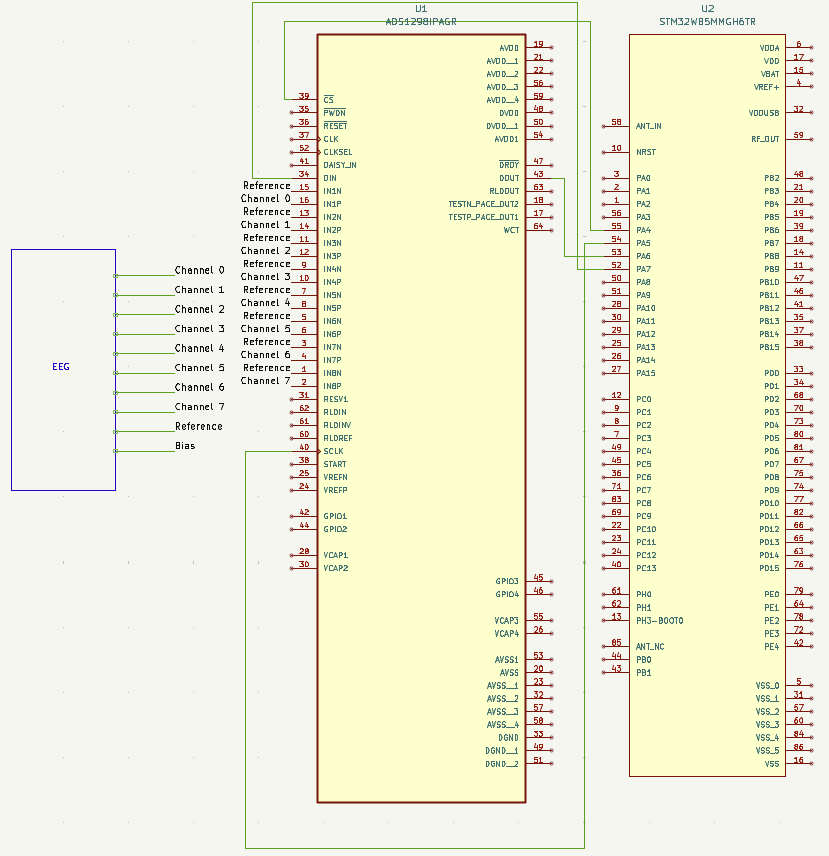

# ECE 445 Notebook Entry 1 (2/9/2026 to 2/13/2026)

## Writing Proposal

### Choosing PCB Components

Why we are using ADS1298 chip as our Analog-to-Digital Converter?

- Costs less than ADS1299 chip (\$45.80 vs \$73.295)
- We can buy multiple
- Supports same \# of channels and resolution for both chips

Why use STM32WB5MMG for Microcontroller?

- Bluetooth Capability 

  
*KiCAD schematic containg ADC and Microcontroller*

  
*Initial Block Diagram showing each subsystem*
