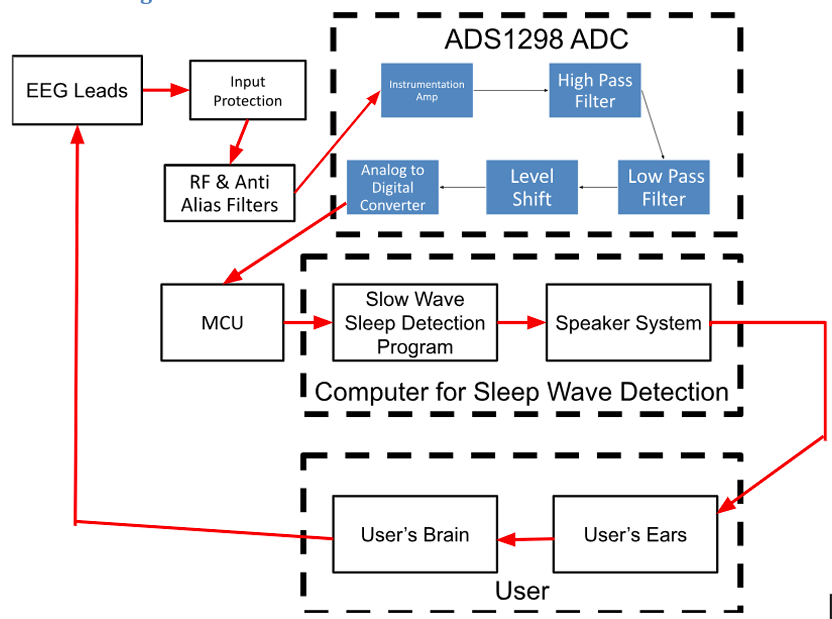

# ECE 445 Notebook Entry 1 (2/9/2026 to 2/13/2026)

## Writing Proposal

This week was mainly centered around writing our proposal. I have detailed the main steps our team took to craft our proposal

### Regualar Communication with our sponsor 
- Our sponsor is the "Sound Sleep" group from the Carle school of Medicine at UIUC
- Provided us with detailed studies and resources about detecting slow wave sleep and the positive effects associated with it
- Helped with finalizing the high-level requirements of our project

### High Level Requirements
- Pink noise should play within 300 ms of detecting slow wave sleep
- The average comfort rating of the headset should be a 4/5
- The entire design should be able to support 10 hours of consecutive sleep, meaning the battery should last at least 10 hours

### Choosing PCB Components

Why we are using ADS1298 chip as our Analog-to-Digital Converter?

- Costs less than ADS1299 chip (\$45.80 vs \$73.295)
- We can buy multiple chips and stay within our \$150 budget
- Supports same \# of channels and resolution for both chips

Why use STM32WB5MMG for Microcontroller?

-  Built-in 2.4 GHz radio handles BLE communication without an external module
-  Vikram has experience using and programming STM Microcontrollers
-  Low power consumption, so fits well with our battery life constraints

### Visuals for Proposal

  
*KiCAD schematic containg ADC and Microcontroller*    

  
*Initial Block Diagram showing each subsystem*    

