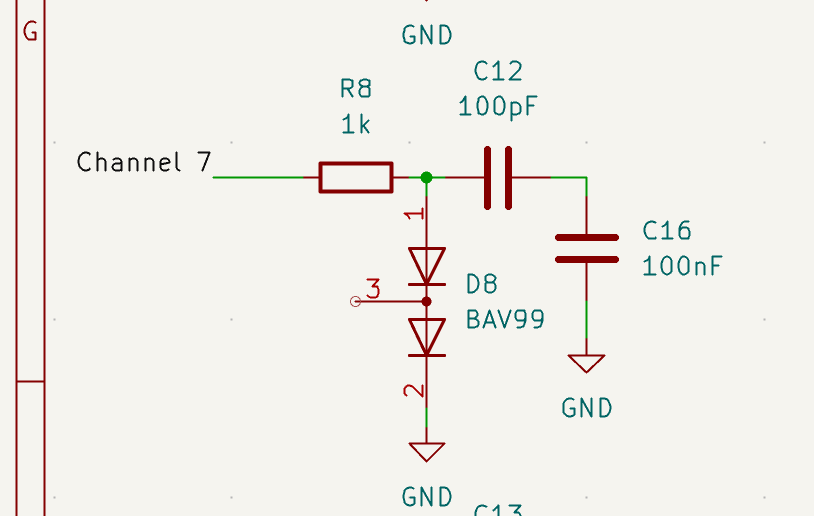
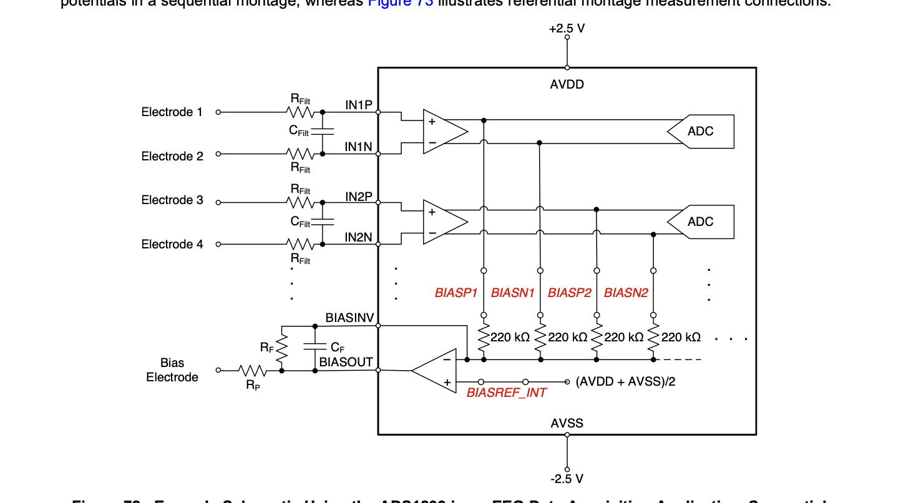
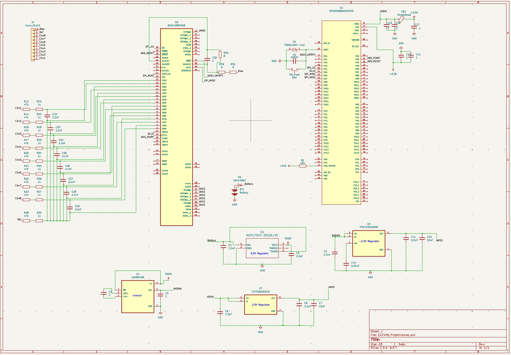

# ECE 445 Notebook Entry 2 (2/16/2026 to 2/20/2026)

Our main objective this week was to make enough progress in our PCB design to go to the PCB review session. This included completing our schematic, assigning proper footprints to each component, and arranging components on the board.

## Changes since Week 1 Proposal

### Switching from ADS1298 to ADS1299 chip
- Realized that using the ADS1298 chip required additional components to make protection circuits for transferring EEG readings to the Analog to Digital Converter (ADC)
- Do not have enough space to fit all the components and wire them properly if using ADS1298
- Struggled with creating a correct protection circuit due to lack of EEG related information on the ADS1298 datasheet
- Realized that the ADS1299 chip's datasheet has a section that goes more in depth about EEG applications
- Switched to using ADS1299 chip due to uncertainty of ADS1298 chip correctly and space constraints
- If we need a backup ADS1299 chip, we will ask our sponsor to fund it

  
*Attempt at designing extra protection for sending EEG signals to ADS1298 chip*    

  
*Protection circuit for sending EEG signals to ADS1299 chip*    

### Built the Power Subsystem
- Used the Cyton Biosensing board as inspiration on how to power our PCB board components
- Had to take into consideration that both the STM microcontroller and ADS1299 chip had varying power needs

## Supporting Docs and Figures

  
*Completed Schematic for PCB review*    

[Link to Cyton Board Design Documents](https://docs.openbci.com/Cyton/CytonSpecs/)

