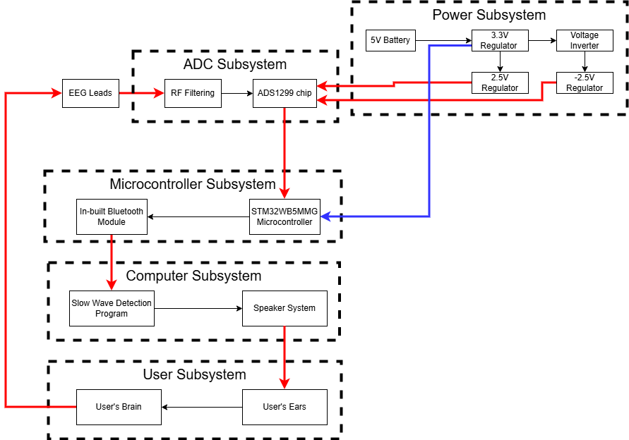

# ECE 445 Notebook Entry 3 (2/23/2026 to 2/27/2026)

Our main objective was to finish the Design Document. Also met with ECE 445 Alumni mentor Jonathan Ashbrook to look over our proposal before starting Design Document.

## Meeting notes with Jonathan Ashbrook
- How to complete our breadboard demo without a proper ADS1299 chip and an STM Dev Board without Bluetooth capability
  - Just show the amplification of 1 channel of EEG data
  - Use an available STM dev board from the lab and transfer data using wired USB

## Writing our Design Document

  
*New Block Diagram for Design Doc*    

