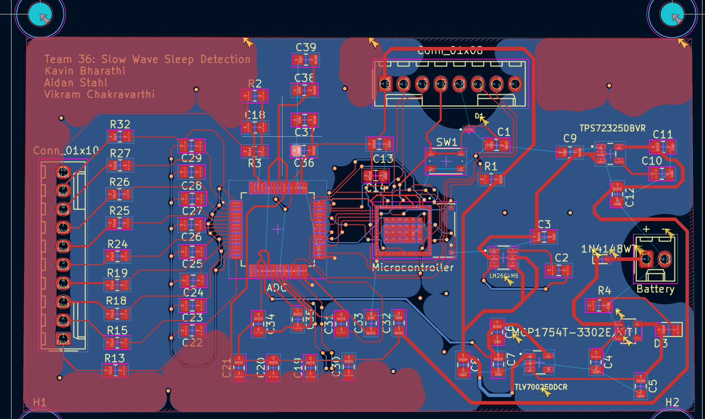

# ECE 445 Notebook Entry 4 (3/2/2026 to 3/6/2026)

Our main objective was fixing our Slow Wave Sleep PCB in time for the 2nd Round of ordering. Although we could not finish solving all of the DRC and layout issues, we still sent an order to test partial functionality.

## Schematic changes

* Realized that we did not make any necessary connections to allow the STM32WB5MMG Microcontroller to be programmable
* Used Connector pins to expose the SWDIO, SWCLK, Vcc, GND, UART_Tx, and UART_Rx for programming and data 
* Changed protection circuit for the STM to be more similar to the datasheet

## DRC Errors Summary

* The front and back grounding layers (B.Cu and F.Cu) were not connected in certain areas
* Various copper islands arose from this
* Many pad spacing errors on the ADS1299 chip

